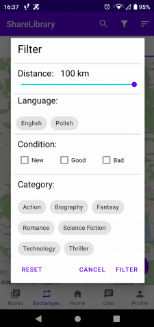

# Sharelibrary client - android client for book exchange application
> Application build as graduate work for bachelor's degree.

## General Information
The main reason to build application was to let users find people from neighborhood and exchange books with them either temporary or permament. User set his exchange place using latitude and longitude. Others can find this location and see what books this user want to borrow or look for. Then they can create a request for exchange. Owner can see for what book he can exchange and then agree or reject. Later they can communicate via chat to set details like date. 

Backend for application: https://github.com/Eliathen/sharelibrary

## Technologies Used
- Kotlin 1.4.1
- Retrofit2
- Koin
- Osmdroid

## Features
- Create exchange
- Filter exchanges by GPS or distance
- Filter exchanges by books details: language, condition, category
- Users can communicate with others via chat

# Screenshots
<table border="0" style ="width : 300px; table-layout: fixed;">
 <tr>
    <td style ="width: 400px; overflow: hidden; text-align:center;"></td>
    <td style ="width: 400px; overflow: hidden; text-align:center;"></td>
    <td style ="width: 400px; overflow: hidden; text-align:center;"></td>
 </tr>
 <tr>
    <td style ="width: 400px; overflow: hidden; text-align:center;">Adding book for exchange. All fields are mandatory</td>
    <td style ="width: 400px; overflow: hidden; text-align:center;">Displaying current exchanges using map. Orange icon stand for user's current exchange place, red is others' exchanges and black is user's current location</td>
    <td style ="width: 400px; overflow: hidden; text-align:center;">Beside standard book's details like language and category users can filter by distance from current location.</td>
 </tr>
</table>
            

